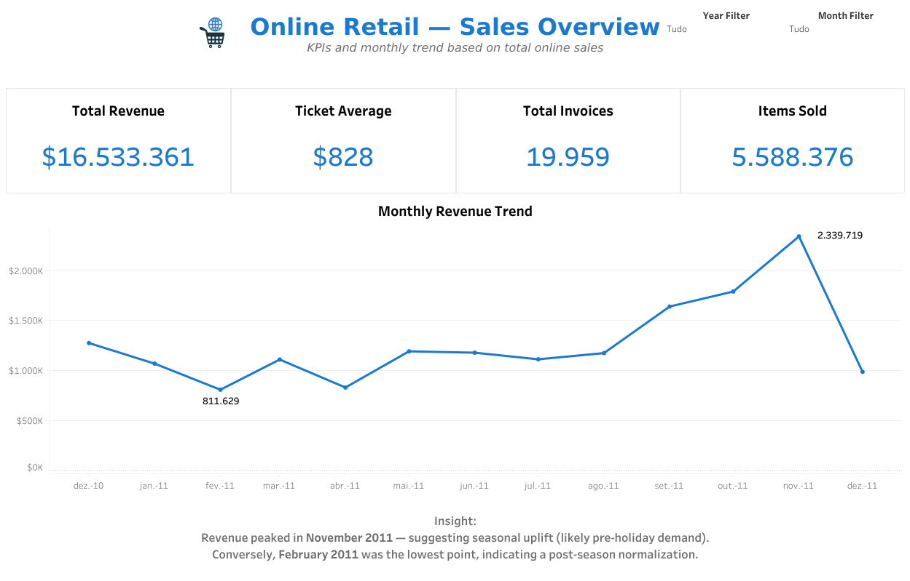

# Online Retail – ETL Pipeline and Tableau Dashboards

This repository contains an end-to-end data preparation workflow for the Online Retail dataset, including an ETL cleaning pipeline in Python and two analytical dashboards built in Tableau.

## Project Overview

The goal of this project is to clean and structure the Online Retail dataset, generate analysis-ready tables, validate data quality, and visualize business insights through interactive dashboards.

The repository includes:
- A Python ETL script for cleaning and transforming the raw CSV file.
- Automated data validation checks.
- Cleaned output tables (CSV and optional Parquet).
- Two Tableau dashboards published on Tableau Public.

## Dashboards (Tableau Public)

### Sales Overview Dashboard
KPIs and monthly revenue analysis.  
Tableau Public: (https://public.tableau.com/views/OnlineRetailExecutiveSalesOverview2010-2011/Dashboard1?:language=pt-BR&:sid=&:redirect=auth&:display_count=n&:origin=viz_share_link)



### Global Markets & Products Dashboard
Top non-UK markets and top-selling products.  
Tableau Public: https://public.tableau.com/views/OnlineRetailGlobalMarketsandProducs/Dashboard2?:language=pt-BR&:sid=&:redirect=auth&:display_count=n&:origin=viz_share_link


## ETL Pipeline

The ETL process includes:
- Column standardization (snake_case)
- Type conversion for dates and numeric fields
- Text normalization (trim, strip, cleanup)
- Derived fields such as `invoice_ym` and `line_total`
- Identification of credit notes
- Splitting into sales and returns tables
- Optional dimension tables for products, customers, and invoices

Implementation can be found in:

- `src/clean.py` – main ETL script
- `src/validation.py` – validation checks

## Running the ETL

1. Install dependencies:

```bash
pip install pandas numpy pyarrow
